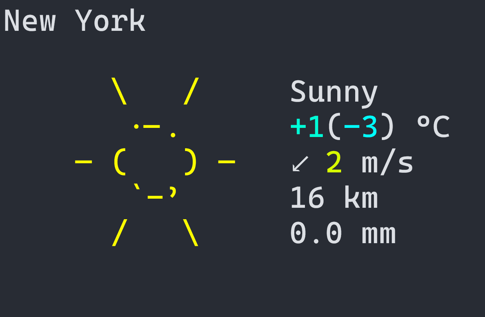
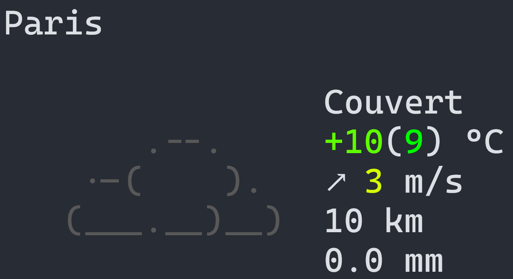
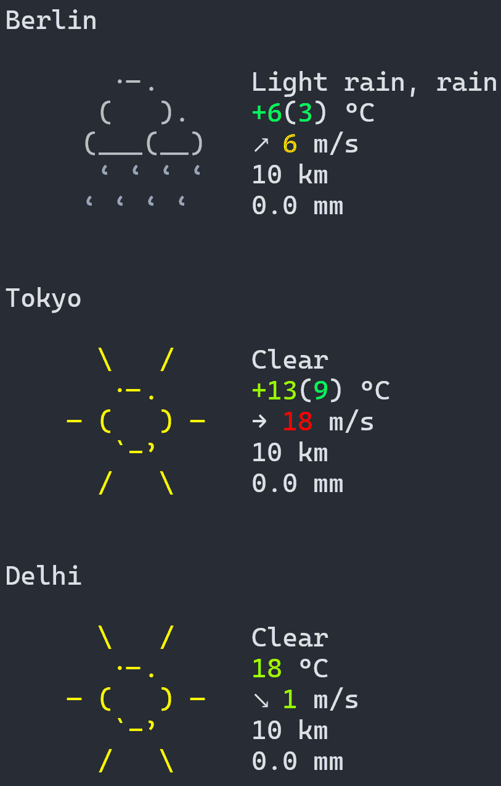

# wttr-cli-rs

A lightweight command-line tool written in Rust to fetch weather information using [wttr.in](https://wttr.in). This tool allows you to quickly retrieve weather data for specified locations in your preferred language, with simple CLI options.

---

## Features
- Fetch weather for multiple locations.
- Option to specify the language of weather details.
- Clean and fast asynchronous HTTP requests with `reqwest`.
- Implements the `wttr.in` API for weather reports.

---

## Installation

1. Clone the repository:
   ```bash
   git clone https://github.com/R-udren/wttr-cli-rs.git
   cd wttr-cli-rs
   ```

2. Build the project using Cargo:
   ```bash
   cargo build --release
   ```

3. Run the compiled binary:
   ```bash
   ./target/release/wttr-cli
   ```

---

## Usage

```bash
Fetch weather information from wttr.in

Usage: wttr-cli.exe [OPTIONS] [LOCATIONS]...

Arguments:
  [LOCATIONS]...  City/location names to get the weather for. [default: ]

Options:
  -l, --lang <LANG>  Specify the language (e.g., ru, fr, de). [default: en]
  -h, --help         Print help
  -V, --version      Print version
```

### Examples

1. Fetch the weather for New York (English):
   ```bash
   wttr-cli "New York"
   ```
   

2. Fetch the weather for Paris in French:
   ```bash
   wttr-cli "Paris" -l fr 
   ```
   

3. Fetch the weather for multiple locations:
   ```bash
   wttr-cli "Berlin" "Tokyo" "Delhi"
   ```
   
---

## Dependencies
This project uses the following Rust dependencies:
- [`reqwest`](https://crates.io/crates/reqwest): Asynchronous HTTP client for making API requests.
- [`clap`](https://crates.io/crates/clap): Command-line argument parsing.
- [`tokio`](https://crates.io/crates/tokio): Asynchronous runtime for running async tasks.

---

## Contributing
Contributions are welcome! Feel free to open an issue or submit a pull request if you'd like to contribute improvements or fixes to the project.

---

## License
This project is licensed under the MIT License. See the [LICENSE](LICENSE) file for details.

---

## Acknowledgments
- Thanks to [wttr.in](https://wttr.in) for providing an awesome weather API!
- A big thanks to the Rust community for maintaining excellent tools and libraries!